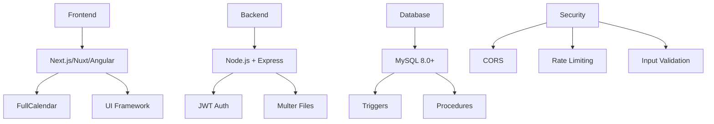

# Diseño del Sistema - Proyecto emblemático: Centro Integral Alerce - Vinculación con el medio

Esta carpeta contiene toda la documentación de diseño técnico, arquitectura y especificaciones visuales del Sistema de Agendamiento para el Proyecto emblemático: Centro Integral Alerce - Vinculación con el medio.

## 🎨 Documentos de Diseño

### [🎨 Especificaciones UX/UI](./especificaciones_ux_ui.md)

**Guía completa de diseño y experiencia de usuario**:

- Paleta de colores institucional (#003B73 azul Santo Tomás oficial)
- Tipografía y jerarquía visual (Roboto)
- Breakpoints responsivos y componentes
- Patrones de interacción y navegación
- Estándares de accesibilidad WCAG 2.1 AA
- Animaciones y transiciones
- Guidelines de contenido

### [📱 Interfaces del Sistema](./interfaces.md)

**Documentación detallada de cada pantalla**:

- 14 interfaces principales del sistema
- Elementos y funcionalidades por pantalla
- Flujos de navegación entre interfaces
- Componentes comunes (header, footer, modales)
- Consideraciones de diseño responsivo
- Observaciones para desarrollo

### [🗄️ Estructura de Base de Datos](./estructura_db.md)

**Diseño completo de la arquitectura de datos**:

- 11 tablas principales del sistema
- Relaciones y claves foráneas
- Índices y constraintes
- Procedimientos almacenados
- Triggers de auditoría
- Scripts de creación y poblar datos

### [🔌 API Endpoints](./api_endpoints.md)

**Documentación completa de la API REST**:

- 30+ endpoints organizados por módulos
- Autenticación y autorización
- Parámetros, headers y cuerpos de petición
- Respuestas de éxito y error
- Códigos de estado HTTP
- Ejemplos de uso detallados

### [📊 Sistema de Reportes](./reportes_consultas.md)

**Diseño del módulo de reportería**:

- 10 tipos de reportes operacionales
- KPIs y métricas del sistema
- Formatos de exportación (Excel, PDF, CSV, JSON)
- Filtros y parámetros personalizables
- Dashboard ejecutivo
- Consultas SQL optimizadas

### [⚠️ Manejo de Errores](./manejo_errores.md)

**Estrategias de gestión de errores**:

- Clasificación de tipos de error
- Mensajes específicos por contexto
- Mecanismos de recuperación
- Patrones de experiencia de usuario
- Sistema de logging y auditoría
- Notificaciones y alertas

### [📊 Diagramas del Sistema](./diagramas_sistema.md)

**Diagramas técnicos completos**:

- Arquitectura general de microservicios
- Modelo entidad-relación de base de datos
- Flujos de autenticación y procesos
- Sistema de permisos granulares
- Arquitectura de despliegue
- Consideraciones de escalabilidad y seguridad

## 🏗️ Arquitectura del Sistema

### Stack Tecnológico

### Componentes Principales

| Componente        | Tecnología           | Responsabilidad              |
| ----------------- | -------------------- | ---------------------------- |
| **Frontend**      | Next.js/Nuxt/Angular | Interfaces de usuario, UX    |
| **API REST**      | Node.js + Express    | Lógica de negocio, endpoints |
| **Base de Datos** | MySQL 8.0+           | Persistencia, integridad     |
| **Autenticación** | JWT                  | Seguridad, autorización      |
| **Archivos**      | Multer + File System | Gestión de documentos        |
| **Calendario**    | FullCalendar         | Visualización, interacción   |

## 📐 Principios de Diseño

### UX/UI Guidelines

- **Usabilidad**: Interfaces intuitivas, navegación clara
- **Accesibilidad**: WCAG 2.1 AA, contraste adecuado
- **Responsividad**: Mobile-first, breakpoints estándar
- **Performance**: Carga rápida, lazy loading
- **Consistencia**: Patrones uniformes, componentes reutilizables

### Arquitectura de Software

- **Separación de responsabilidades**: Frontend/Backend/DB
- **API RESTful**: Endpoints consistentes, códigos HTTP estándar
- **Seguridad por diseño**: Validación, sanitización, autenticación
- **Escalabilidad**: Código modular, base de datos optimizada
- **Mantenibilidad**: Código limpio, documentación completa

## 🎯 Especificaciones Técnicas

### Base de Datos

- **Tablas**: 11 entidades principales
- **Relaciones**: Claves foráneas bien definidas
- **Índices**: Optimización de consultas frecuentes
- **Triggers**: Auditoría automática de cambios
- **Procedures**: Lógica compleja en la base

### API REST

- **Endpoints**: 30+ rutas organizadas por módulos
- **Autenticación**: JWT con middleware personalizado
- **Validación**: express-validator en todas las rutas
- **Documentación**: Swagger/OpenAPI 3.0
- **Testing**: Cobertura de pruebas unitarias

### Frontend

- **Componentes**: Biblioteca reutilizable
- **Estado**: Gestión centralizada (Context/Pinia/NgRx)
- **Routing**: Navegación protegida por permisos
- **Forms**: Validación en tiempo real
- **Calendar**: FullCalendar con drag & drop

## 📊 Métricas de Diseño

### Rendimiento

- **Carga inicial**: < 3 segundos
- **Time to Interactive**: < 5 segundos
- **Bundle size**: Optimizado con tree-shaking
- **Images**: Formato WebP, lazy loading
- **API**: Respuestas < 500ms promedio

### Accesibilidad

- **Contraste**: Mínimo 4.5:1 (WCAG AA)
- **Navegación**: Soporte completo por teclado
- **Screen readers**: Etiquetas aria correctas
- **Focus management**: Indicadores visibles
- **Color**: No dependencia exclusiva del color

### Responsividad

- **Mobile**: 576px+ completamente funcional
- **Tablet**: 768px+ experiencia optimizada
- **Desktop**: 1024px+ funcionalidad completa
- **Touch**: Targets mínimo 44px
- **Viewport**: Meta tag responsive configurado

## 🔗 Enlaces Relacionados

### Documentación de Requerimientos

- [🎯 Requerimientos Principales](../Requerimientos/requerimientos.md)
- [📋 Reglas de Negocio](../Requerimientos/reglas_negocio.md)
- [✅ Criterios de Aceptación](../Requerimientos/criterios_aceptacion.md)
- [🔍 Validaciones del Sistema](../Requerimientos/validaciones.md)

### Documentación General

- [📖 README Principal](../General/README.md)
- [🚀 Guía de Implementación](../General/guia_implementacion.md)

## ✅ Estado de Completitud

### Diseño Visual

- [x] **Paleta de colores** - Colores institucionales actualizados según Santo Tomás oficial
- [x] **Tipografía** - Roboto como fuente principal
- [x] **Componentes** - 20+ componentes especificados
- [x] **Breakpoints** - 4 tamaños de pantalla
- [x] **Accesibilidad** - WCAG 2.1 AA completo
- [x] **Animaciones** - Micro-interacciones definidas

### Arquitectura Técnica

- [x] **Base de datos** - 11 tablas diseñadas
- [x] **API REST** - 30+ endpoints documentados
- [x] **Seguridad** - JWT, validaciones, sanitización
- [x] **Archivos** - Sistema sin límites implementado
- [x] **Reportes** - 10 tipos de reportes diseñados
- [x] **Errores** - Manejo integral especificado

### Documentación

- [x] **Interfaces** - 14 pantallas documentadas
- [x] **Flujos** - Navegación y procesos definidos
- [x] **Componentes** - Reutilización especificada
- [x] **Performance** - Métricas y optimizaciones
- [x] **Testing** - Estrategias de pruebas definidas

## 🎯 Uso de Esta Documentación

### Para Diseñadores UX/UI

1. **Comenzar con**: [especificaciones_ux_ui.md](./especificaciones_ux_ui.md) - Guidelines completas
2. **Revisar interfaces**: [interfaces.md](./interfaces.md) - Pantallas específicas
3. **Validar flujos**: Navegación y patrones de interacción
4. **Verificar accesibilidad**: Cumplimiento WCAG 2.1 AA

### Para Desarrolladores Frontend

1. **Estudiar interfaces**: Elementos y funcionalidades
2. **Implementar componentes**: Especificaciones detalladas
3. **Seguir guidelines**: UX/UI consistente
4. **Validar responsividad**: Breakpoints definidos

### Para Desarrolladores Backend

1. **Revisar API**: [api_endpoints.md](./api_endpoints.md) - Endpoints completos
2. **Implementar base de datos**: [estructura_db.md](./estructura_db.md) - Diseño detallado
3. **Manejar errores**: [manejo_errores.md](./manejo_errores.md) - Estrategias definidas
4. **Generar reportes**: [reportes_consultas.md](./reportes_consultas.md) - 10 tipos implementados

### Para Arquitectos de Software

1. **Revisar stack completo**: Tecnologías y patrones
2. **Validar seguridad**: JWT, validaciones, sanitización
3. **Optimizar performance**: Índices, consultas, caching
4. **Planificar escalabilidad**: Arquitectura modular

---

**Nota**: Esta documentación de diseño está completamente alineada con los requerimientos y criterios de aceptación. Cada especificación ha sido validada para asegurar la implementación exitosa del sistema.

_Proyecto emblemático: Centro Integral Alerce - Vinculación con el medio - Santo Tomás Puerto Montt_
