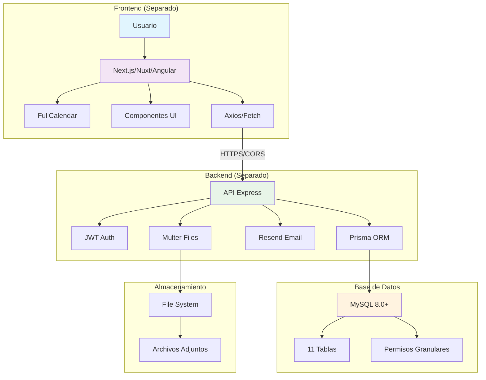
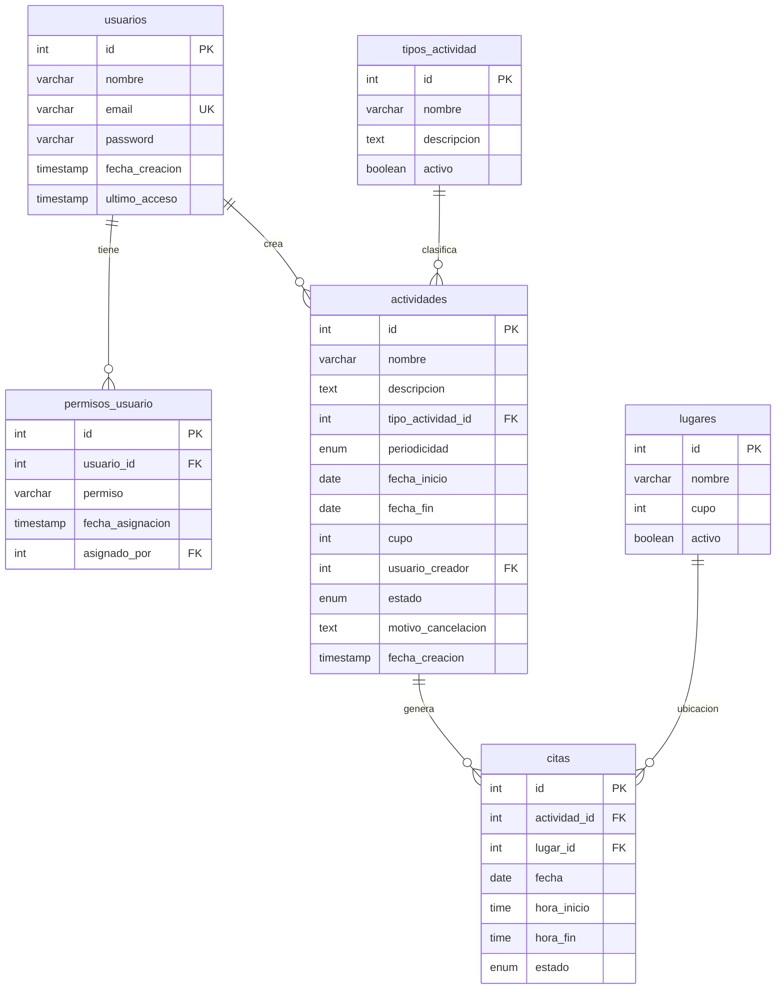
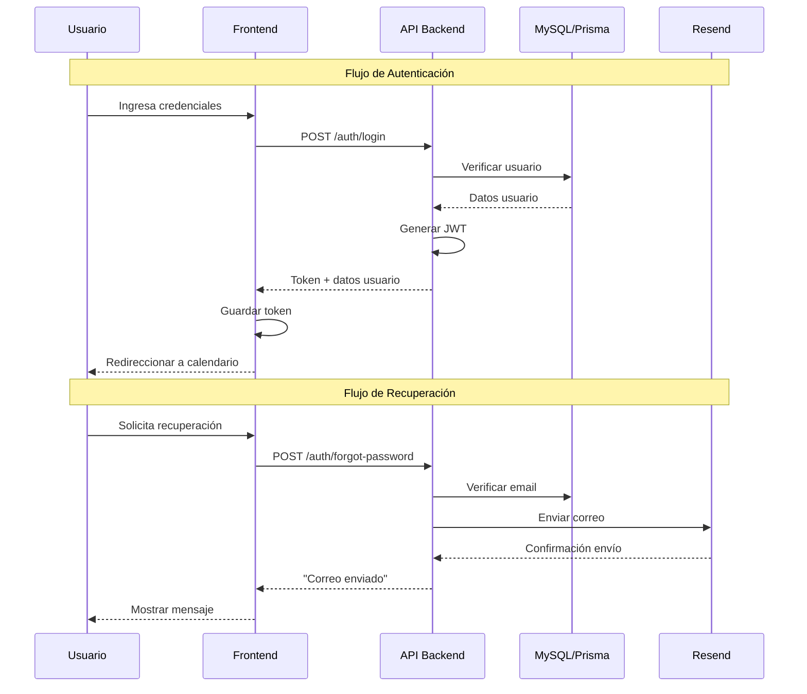
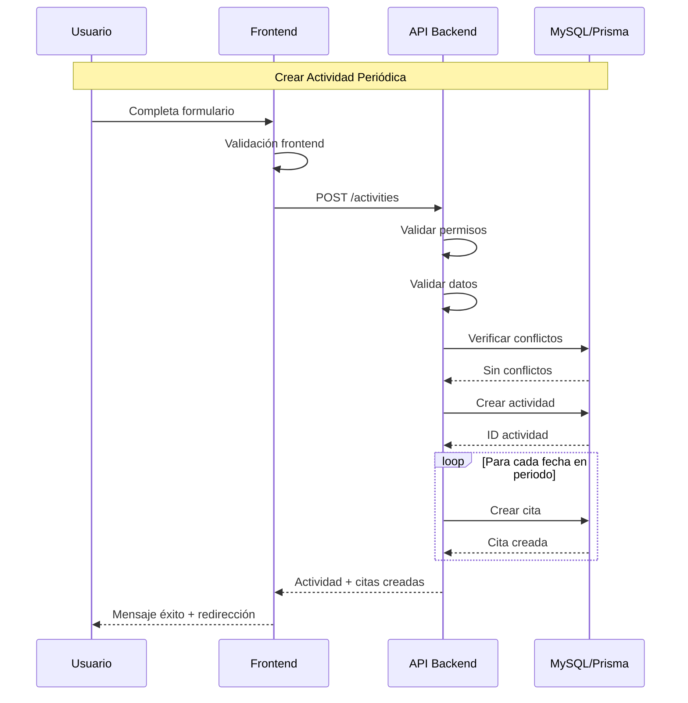
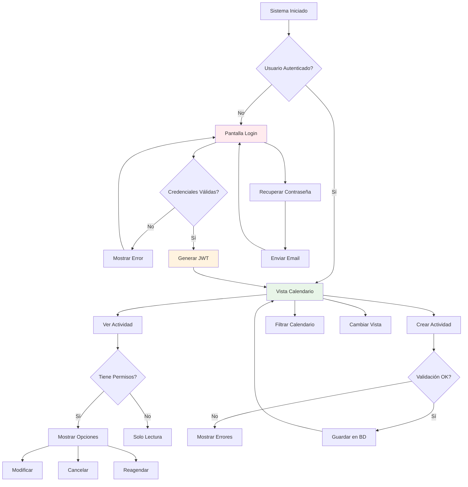
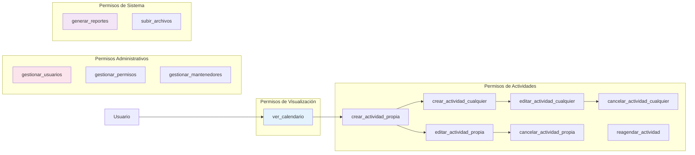
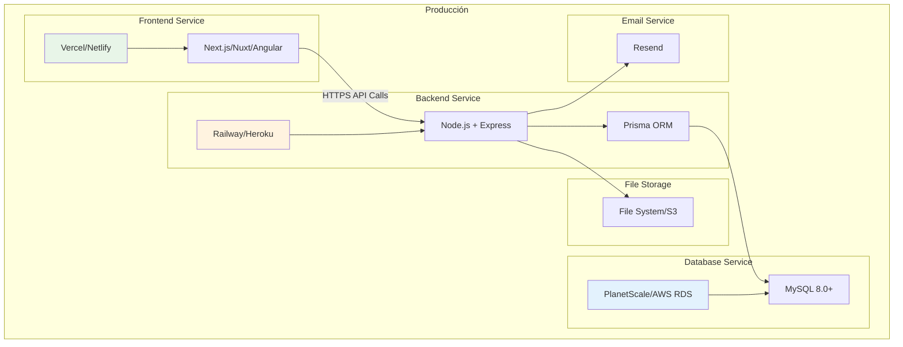

# Diagramas del Sistema - Centro Integral Alerce

Este documento contiene los diagramas técnicos del Sistema de Agendamiento del Proyecto emblemático: Centro Integral Alerce - Vinculación con el medio.

## 1. Arquitectura General del Sistema

**Descripción**: Arquitectura de microservicios con frontend y backend completamente separados, comunicándose vía API REST con autenticación JWT.

## 2. Modelo de Base de Datos (Entidad-Relación)

**Descripción**: Modelo relacional con sistema de permisos granular por usuario, sin roles predefinidos. Actividades pueden generar múltiples citas según periodicidad.

## 3. Flujo de Autenticación

**Descripción**: Autenticación JWT con recuperación de contraseña vía Resend. Tokens almacenados en frontend para sesiones persistentes.

## 4. Flujo de Creación de Actividades

**Descripción**: Proceso de creación con validación de permisos, conflictos de horario y generación automática de citas para actividades periódicas.

## 5. Flujo de Navegación del Sistema

**Descripción**: Flujo principal de navegación con control de permisos y validaciones en cada etapa del proceso.

## 6. Sistema de Permisos Granulares

**Descripción**: Sistema de 13 permisos granulares que se asignan individualmente a cada usuario, sin roles predefinidos.

## 7. Arquitectura de Despliegue

**Descripción**: Arquitectura de despliegue en servicios separados con comunicación HTTPS y configuración CORS adecuada.

## Consideraciones Técnicas

### Escalabilidad

- **Frontend**: CDN global para carga rápida
- **Backend**: Auto-scaling basado en demanda
- **Base de Datos**: Conexiones optimizadas con pooling
- **Archivos**: Almacenamiento distribuido

### Seguridad

- **HTTPS**: Obligatorio en todas las comunicaciones
- **JWT**: Tokens con expiración configurable
- **CORS**: Configurado para dominios específicos
- **Validación**: Frontend y backend en todas las entradas

### Monitoreo

- **Logs**: Centralizados para análisis
- **Métricas**: Performance y uso del sistema
- **Alertas**: Notificaciones de errores críticos
- **Backup**: Respaldos automáticos de BD

---

**Nota**: Estos diagramas reflejan la arquitectura final del sistema según las especificaciones técnicas definidas.
