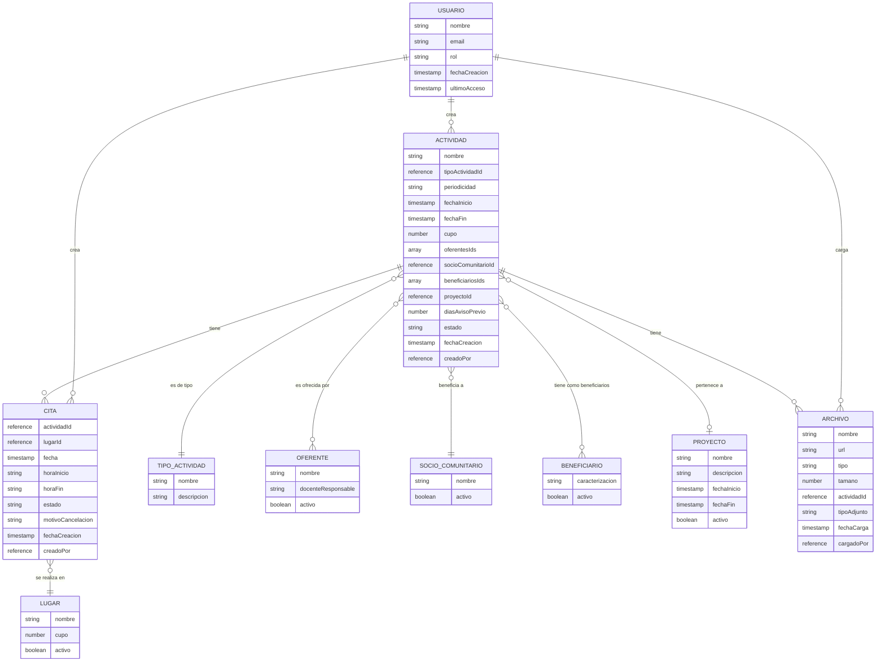

# Modelo Entidad-Relación

El siguiente diagrama muestra el modelo entidad-relación para el sistema de agendamiento del Proyecto emblemático: Centro Integral Alerce - Vinculación con el medio:

## Descripción de las Entidades

### ACTIVIDAD

Representa las actividades que se realizan en el centro. Puede ser puntual (una sola cita) o periódica (múltiples citas).

### CITA

Representa una fecha-hora-lugar específica en la que se realiza una actividad.

### TIPO_ACTIVIDAD

Catálogo de tipos de actividades (capacitación, taller, charla, etc.).

### LUGAR

Catálogo de lugares donde se pueden realizar las actividades.

### OFERENTE

Representa las carreras u otras entidades que ofrecen las actividades.

### SOCIO_COMUNITARIO

Representa a los socios comunitarios beneficiados por las actividades.

### BENEFICIARIO

Representa a los beneficiarios del servicio.

### PROYECTO

Agrupación opcional de actividades.

### ARCHIVO

Metadatos de archivos adjuntos a las actividades.

### USUARIO

Usuarios del sistema con sus roles y permisos.

## Relaciones Principales

- Una actividad puede tener múltiples citas (1:N)
- Una actividad puede tener múltiples archivos adjuntos (1:N)
- Una actividad tiene un tipo específico (N:1)
- Una actividad puede ser ofrecida por múltiples oferentes (N:M)
- Una actividad beneficia a un socio comunitario específico (N:1)
- Una actividad puede tener múltiples beneficiarios (N:M)
- Una actividad puede pertenecer a un proyecto (opcional, N:1)
- Una cita se realiza en un lugar específico (N:1)
- Un usuario puede crear múltiples actividades, citas y cargar múltiples archivos (1:N)

Este modelo entidad-relación sirve como base para la estructura de la base de datos MySQL detallada en el archivo estructura_db.md.
