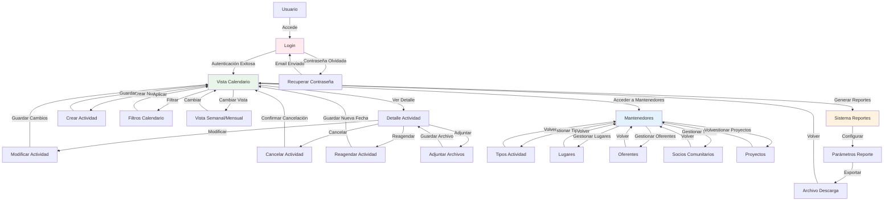

# Diagrama de Flujo del Sistema

El siguiente diagrama muestra el flujo principal de navegación entre las distintas interfaces del sistema:

> **Nota**: Para diagramas técnicos más detallados consulte [Diagramas del Sistema](../Diseño/diagramas_sistema.md)

## Descripción del Flujo

1. El usuario accede al sistema a través de la pantalla de Login.
2. Tras autenticarse correctamente, accede a la Vista de Calendario (pantalla principal).
3. Desde la Vista de Calendario puede:
   - Ver el detalle de una actividad existente
   - Crear una nueva actividad
   - Acceder a los mantenedores
4. Desde el Detalle de Actividad puede:
   - Modificar la actividad
   - Cancelar la actividad
   - Reagendar la actividad
   - Adjuntar nueva información
5. Los mantenedores permiten gestionar los catálogos del sistema:
   - Tipos de actividad
   - Lugares
   - Oferentes
   - Socios comunitarios
   - Proyectos

Este flujo representa las principales interacciones del usuario con el sistema, aunque existen más interacciones detalladas en la documentación de interfaces.
